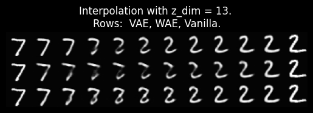

# Variational and Wasserstein Image Autoencodes 

The purpose of this repository is to compare two types of regularized autoencoders: Variational Autoencoder (VAE) and Wasserstein Autoencoder (WAE). 

Regularized autoencoders add an extra loss that enforces the latent distribution to be closer to the given latent prior (e.q. standard normal distribution). This results in easier sampling, stable training and other benefits. The main differences between VAE and WAE are 1) how we measure the discrepancy from our prior and 2) whether we need a stochastic encoder.

VAEs are the most popular type of regularized autoencoders. On the other hand, WAE may be a better choice for certain problems, where Wasserstein distance is more suitable. Additionally, WAE-MMD variant is slightly easier to implement as there's no need to have an encoder that behaves differently during the training and inference. 

Note that: all models here are implemented from scratch in Tensorflow - except for MMD loss, which is based on the original WAE implementation: 
https://github.com/tolstikhin/wae . The code is based on my implementation from 2021 refactored to be compatible with TF 2.13.  

## Overview 

This readme is separated into the following parts: 
1) Variational Autoencoders - loss and training algorithm.
2) Wasserstein Autoencoders - loss and training algorithm.
3) Setup instructions (work in progress).
4) Experiments - VAE and WAE compared on MNIST. 
5) References to related papers and repositories. 

Unlike most of literature on regularized autoencoders, I'll start with the final training algorithms and then briefly explain the theory behind them. 

## Variational Autoencoders 

<!-- add an images from the paper -->

Assuming we have a vanilla autoencoder, we can turn it into VAE with two modifications: 1) make the encoder stochastic and 2) add an extra regularization.

#### Stochastic encoder

We want the output of VAE encoder to be a random variable $z \sim N(\mu_x, \sigma_x^2 I)$, where both $\mu_x$ and $\sigma_x^2$ depend on the input image $x$. The easiest way to implement VAE encoder is to add an extra output to the encoder neural network. Both outputs can be represented with a single feature vector. Two outputs are then interpreted as: 
- $\mu_x$: mean vector  
- $\log(\sigma_x)$: log variance vector  

The final VAE encoder output is: 
- $z=\mu_x+\sigma_x\epsilon$, where $\epsilon \sim N(0, I)$ 

Note that for inference with a trained model, we usually make the encoder deterministic by only using the mean value $z=\mu_x$. 

#### Latent Regularization

In order to get latent distribution that's close to our prior, we add an additional loss term. Our new loss function will have form: $L = L_{rec} + L_{reg}$, where $L_{rec}$ is the same reconstruction loss (MSE) as used in vanilla autoencoders. 

The regularization loss $L_{reg}$ is the following KL-divergence between our output distribution $N(\mu,\sigma^2I)$ and prior distribution: 
<!--
$$L_{reg} = D_{KL}( N(\mu, \sigma ^2 I), N(0, I))$$
$$=\frac{1}{2} \sum_{i=0}^k \left(\sigma_i^2 + \mu_i^2 - 2 \log(\sigma_i) - 1\right)$$
-->

$$L_{reg} = D_{KL}( N(\mu, \sigma ^2 I), N(0, I))=\frac{1}{2} \sum_{i=0}^k \left(\sigma_i^2 + \mu_i^2 - 2 \log(\sigma_i) - 1\right)$$

Minimization of the KL-divergence leads to approximately normal distribution of our latent vectors after training. This is easy to compute as $\mu$ and $\log(\sigma)$ are outputs of the encoder neural network. 

#### VAE Training Algorithm

When we combine the two modifications, we get the following training algorithm: 

VAE Training Step:
 1. Sample image x from the given training dataset and random noise $\epsilon \sim N(0, I)$
 2. Evaluate encoder neural network: $\mu_x,log(\sigma_x)=Encoder(x)$
 3. Sample z: $z = \mu_x + \sigma_x * \epsilon$
 5. Evaluate decoder neural network to get reconstructed image: $\hat x = Decoder(z)$
 6. Compute reconstruction error (MSE): $L_{rec} = L_{rec}(x, \hat x)$
 7. Compute regularization error: $L_{reg} = \frac{1}{2} \sum { \left(\sigma_i^2 + \mu_i^2 - 2 \log(\sigma_i) - 1\right) }$  
 8. Update encoder and decoder parameters. 

For simplicity I assumed batch of size one. In practice, we usually sample a batch of multiple images.  


### More Details on VAE

In the following, I'll try to give a brief introduction to VAE theory and derive the training algorithm. 

#### Problem Statement

Let's consider the following generative model:

$$ P(X; \theta) = \int {P(X | z; \theta) } P(z) dz $$

Where $X$ is a random image, $z$ is latent vector with prior distribution $P(z)$ and $\theta$ model parameters.

This gives us the probability of an image $X$ given the generative model with parameters $\theta$. Our goal is to find $\theta$ that maximizes this probability over all observed data (maximum likelihood).

#### Approximate Inference (Encoder)

Optimizing $P(X; \theta)$ is not generally tractable. The problem is that to compute $P(X; \theta)$, we would need to compute an integral over all possible values of latent vector $z$. 

A naive solution might be sampling random vectors $z$ to estimate the integral. The problem here is that for most latent vectors $P(X | z)$ will be close to zero. 

A better solution would be sampling only $z$ likely produced the given image $X$, i.e. $P(X | z)$ will be larger. 

We define a stochastic encoder that takes input image $X$ and generates latent vector from a distribution  $Q(z| X )$, i.e. that depends on the given image. This will allow us to generate z with high $P(X | z)$. 

#### Evidence Lower Bound 

Instead of directly maximizing $\log P(X)$, we will maximize it's lower bound, which is easier to compute. 
Evidence Lower Bound (ELBO) is defined as follows:

$$ 
L_{ELBO} = \log P(X) - 
D_{KL} (Q(z | X) || P(z | X)) 
$$

The first term is log-likelihood we want to maximize. The second term in KL-divergence that pushes our encoder distribution close to our prior. We will assume $N(0,I)$ prior, that's most commonly used. 

Instead of computing ELBO directly we use the following form:

$$\log P(X) - D_{KL} (Q(z | X) || P(z | X))$$
$$= \\ E_{z \sim Q}[ log P(X | z)]- D_{KL} (Q(z | X) || P(z))$$

Left side of the equation is what we want to optimize. The right side of the equation is something we can optimize. 

Notice that be maximizing ELBO, we 1) minimize reconstruction loss (as $log P(X | z)$ leads to MSE loss and) and 2) minimize distance from our prior distribution $P(z)$. 


#### Reparameterization trick

To be able to compute gradients, we need to move all "randomness" into our input.

We start with sampling random image X and noise $\epsilon \sim N(0, I)$. After that the rest of the computation is deterministic. 

We exppress z as: 
$$z_{x, \epsilon} = \mu_x + \sigma_x * \epsilon$$

Now, we can rewrite our ELBO loss as: 

$$L_{ELBO} = E_{X}[ E_z [...] - D_{KL} (Q(z | X) || P(z))  ]$$

Which gives us our training algorithm. 


<!-- 
TODO what is autoencoder 
TODO why use regularization 
 -->


## Wasserstein Autoencoders 

Let me explain an another way to regularize autoencoders: Wasserstein Autoencoders (WAE). 

Similar to VAE, WAE regularize latent space to match our prior distribution (usually $N(0,I)$). The main difference is how we measure the distance from our prior. 

There're two alternaive ways to train WAE: WAE-MMD and WAE-GAN ...

<!-- Bried outline -->

### WAE-GAN

Fist way to train Wasserstein autoencoder is by adversarial training. This requires adding one more neural network - latent discriminator that's trained together with encoder and decoder. 

The discriminator takes latent code z and predicts whether it was produced by encoder or sampled from our prior distribution. It usually has the same number of layers as our encoder and decoder. 

<!--  -->

<center>


</center>

WAE-GAN usually results in higher quality of sampled (randomly generated) images, but the training may be less stable compared to VAE and WAE-MMD and we need to add an extra neural network. 

### WAE-MMD 

The second variant of Wasserstein autoencoder - WAE-MMD is easer to implement as it only adds an extra penalty to our loss function. 

Maximum Mean Discrepancy (MMD) between our latent and prior distribution can be easily estimated from the produced latent codes and vectors sampled from our prior. 

The usual choise for our kernel is a RBF kernel. (formula)

WAE-MMD is suatable for higher dimensial latent spaces, has stable training (as VAE) and it's easy to implement - no need to introduce discriminator or have a stochastic encoder as in VAE. On the other hand, quality of sampled images might be slightly lower compared to WAE-GAN.


### Wasserstein Distance

VAE uses KL-divergence, here we use Wasserstein distance instead. 

An intuition behind Wassersten distance (also known as Earth Mover’s distance) is the minimum energy cost of moving a pile of dirt in the shape of one probability distribution to the shape of the other distribution. 
<!-- 
TODO download it into repo? 
TODO give an example - compare with KL? 


-->


Wasserstein distance is a weaker measure, which means it's more "sensitive" to differences between two probability distributions. 

Here's a comparison of Wasserstein and KL divergence on two pairs of discrete probability distribtutions. 

<center>

</center>


On the left, we have two distributions with high Wasserstein distance. On the right, two distributions with small Wasserstein distance. Notice that in both cases, KL divergence is the same.

Depending on the application, Wasserstein distance can be better choice than KL and can lead to more informed gradients. 


<!-- 
- two allgorithms 
- compare all methods also with VAE
- theory (briefly, read more sources  )
   - distance
   - overlapping gaussians 
   - duality + gan training
   - MMD loss explain briefly in more details  
- literature 
 -->


<!-- 
Sources 

https://kowshikchilamkurthy.medium.com/wasserstein-distance-contraction-mapping-and-modern-rl-theory-93ef740ae867
 -->

# Project Structure

In this part I'm going to explain imlepentation of two models. 

Work in progress ... 


## Setup

```
git clone ...
cd image-autoencoders
python3 -m venv venv
source venv/bin/activate

pip install -r requirements.txt

```

TODO Docker setup

Note that this project is based on my older code using an older version of tensorflow. There might be a better way to implement certain parts now. 


# Experiments

In the following experiemnts I compare VAE, WAE and Vanilla autoencoder with different latent dimensions. The models are compared on MNIST dataset from three main aspects: reconstruction, sampling and interpolations. All results are shown on the test set that is not used for training. 


## Stacking Autoencoders

Instead of autoencoding images directly into latent vectors, we use two stage approach: 1) train a fully convolutional autoencoder (convAE) to encode the original images into lower resolution images and 2) train an another autoencoder (stackedAE) to encode smaller images into latent vectors.  

### Motivation

The main advantage of stacking autoencoders is faster
training. This is specially significant when training multiple models with different latent dimension and type of latent regularization. 

We only need to train convAE once, which is the only compute intentive training that requires a GPU. After than stackedAE can be trained in significantly shother time on CPU.   

This way we can train 18 different models (with different latent dimension and regularization type) in just few hours. It also allows us to tune hyper-parameters in a shorter time. 

<!-- TODO visualize the stacking (img from wiki?) -->


### Convolutional Autoencoder

The fully convolutional autoencoder (convAE) is trained for 100k steps on MNIST dataset. Images 28x28 are encoded into 7x7x10 low resolution tensors (latent images). 

From sample test reconstructions, we can see that the reconstruction here is almost perfect.  


After training, we encoder all MNIST images and all further training are done on latent 7x7x10 images. 

### Stacked (Latent) Autoencoder 

Stacked Autoencoder has a simple architecture - both encoder and decoder consist of three fully connected layers. There're no convolutional layers. 

In the following experiments, we compare three different types of latent regularization:
Variational autoencoder (VAE), Wasserstein autoencoder (WAE) and classical 
unregularized vanilla autoencoder. 

## Reconstruction

### Mean Reconstruction Error

First, we compare reconstruction error for all types of models and multiple latent dimensions. The reconstruction error is an average test mean squared error. 

<center>

</center>

We can see that Vanilla autoencoder has the lowest error. This is expected as it only reconstruction error is minimized during the training.

For most latent dimensions, VAE has lower reconstruction eror, which might be caused by setting too strong regularization weight for WAE. (A better comparison would be plotting 
multiple WAE models with different regularization strenght.)

### Reconstructions on a Small Sample 

Let's compare reconstructed images using different model types. 

<center>


</center>

We can see that models with smaller latent dimension 
do not always reconstruct digits correctly. This gets better with more latent parameters. 

Note that: lower reconstruction error does not always lead to better models. Models with higher latent dimension may fit unwanted noise. 

## Sampling

Another important property of autoencoders is being able to generate random images - in our case images of digits. 

Both VAE and WAE are trained to have approximately normal distribution of the latent space. To sample random images, we can sample z from $N(0, I)$ and apply the model encoder. 

### Sample Generated Images

Unlinke regularized autoencoders, sampling using vanilla autoencoder is more difficult as the latent distribution is not restricted. 


We can see that the most of generated images using vanilla AE are either noisy or just an empty image as the sampled latent vectors do not correspond to any meaningful images. 

Quality of the generated images for VAE and WAE seem comparable. 

Small latent dimensions usually lead to more common / average images. With increasing dimensionality, AE can generate more uncommon shapes (see the results for dim=5,8). When the latent dimension is too high, he sampling becomes harder as most of the latent space 
does not represent anything meaningful due to curse of dimensionality (https://en.wikipedia.org/wiki/Curse_of_dimensionality). 

### Latent Distribution

To get a better understanding of generative capabilities, we can plot latent distributions. 

We encode the whole test set using different models for latent dimensions 2 and 3. 


In case of three dimensions, we plot all pairs of axis. For comparison we also plot a sample from normal distibution. 


We can see that the latent distribution of VAE and WAE look more similar to the sample from normal distribution as expected.

## Interpolation

One the most important properties of autoencoders is ability to interpolate between two images. 

In order to interpolate two images, we encode both of them into latent vectors, interpolate latent vectors and for each interpolated latent vectors generate an intermediate image. 


### How to Compare Interpolations

For MNIST digits, it's not obvious what should be wanted behaviour here. 
 * Do we prefer all interpolated images to be valid digits?
 * Or would we prefer having smooth transition between them? 

Example: 
 * Say we want to interpolate between "1" and "0". Is it preferable to have the interpolated image that's a valid "6" digit or something that's look more like something between "1" and "0"?

Depending on the application we might have differet preferences. This behaviour can be influenced by our choice of regularization and the number of latent parameters. 

### Sample Interpolations

In the following, we plot two randomly selected mnist digits  "7" (left) and "2" (right). All images between them are interpolations using VAE, WAE and Vanilla autoencoder.   

Generally, with smaller latent dimension, it might be difficult to avoid getting different digits when interpolaring between two digits. Notice that when interpolating between "7" and "2", we often get "3". 


 In higher dimensions, interpolations are
usually smooth transition from one number to the another one. 




When the latent dimension is too high. We have a similar problem as with random sampling - "holes" in the latent space that does not correspond to any images similar to our dataset. 


## Final Thoughts

### Latent Dimension

There's a trade-off between good reconstruction and sampling capabilities. Depending on the application with might prefer smaller or larger latent dimension. 

With higher latent dimension, we usually get near perfect reconstruction, but almost all generated samples will be  noisy as only a tiny fraction of our latent space with encode something meaningful.    

When using small latent dimension, most of random samples will corespond to images similar to our training dataset. On the other hand, we will not be able to represent all images from our dataset with too few latent parameters. Usually, only most common images will be reconstructed correctly. Sometimes this can be wanted behavior and can help us to remove noise.  

### VAE vs WAE

When it comes to VAE vs WAE. From the results, it's not clear which one leads to better results. From practical perspective, WAE is easier to implement as it does not require stochastic encoder, only an extra term in the loss function is needed. 

## References 

1. [Tutorial on Variational Autoencoders](https://arxiv.org/abs/1606.05908)
2. [Wasserstein Auto-Encoders](https://arxiv.org/abs/1711.01558)
3. [Wasserstein Auto-Encoders (original repository)](https://github.com/tolstikhin/wae)

